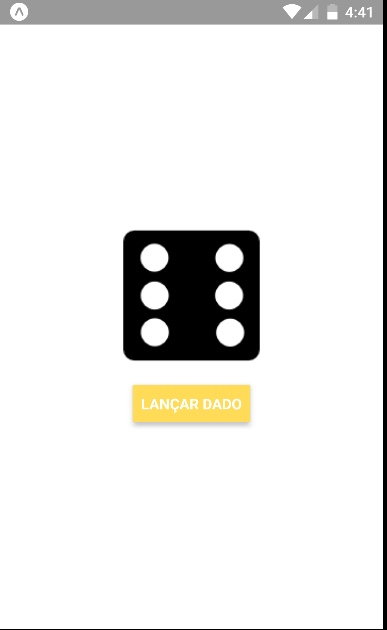

# Aplicativo do Dado

## Atividade

Criar um componente chamado Dice que siga o seguinte layout:

Ao apertar o botão o componente deve sortear um número entre 1 e 6 e então mostrar a imagem do dado correspondente.

Entregar o aplicativo via Moodle.

## Pré-requisitos

* Git
* Nodejs
* Yarn
* Aplicativo "Expo App" da [Google Play](https://play.google.com/store/apps/details?id=host.exp.exponent) ou [App Store](https://itunes.apple.com/us/app/expo-client/id982107779)

## Como instalar e executar

1. Instalar o pacote do nodejs ``create-react-native-app`` executando  seguinte comando no Git Bash:

  * ``npm install -g create-react-native-app``

2. Atualizar o npm e instalar o pacote ``yarn`` com o seguinte comando:

  * ``npm install -g npm@latest``
  * ``npm install -g yarn``

3. Instalar as dependências do projeto por meio de três comandos no Git Bash:
  * ``npm install``
  * ``yarn install``

4. Executar o projeto por meio do comando no Git Bash:
  * ``npm run start``
5. Conectar o celular na mesma rede do computador e então ler o QR Code.
